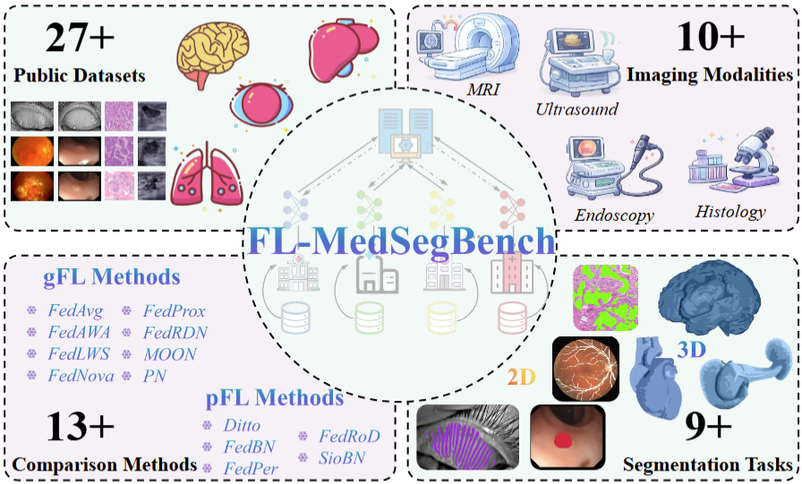

# FL-MedSegBench

## Updates

- **(2026-03-11)** Initial release. 



## Table of Contents

- [Overview](#overview)
- [Highlights](#highlights)
- [Datasets and Tasks](#datasets-and-tasks)
- [Imaging Modalities](#imaging-modalities)
- [Implemented Methods](#implemented-methods)
- [Getting Started](#getting-started)
- [Citation](#citation)

**FL-MedSegBench** is a benchmark designed for **federated learning (FL) in medical image segmentation**. It provides a unified experimental framework to systematically evaluate both **generic federated learning (gFL)** methods and **personalized federated learning (pFL)** methods across diverse medical imaging scenarios.

This benchmark covers:

- **27+ public datasets**
- **10+ imaging modalities**
- **9+ segmentation tasks**
- **13+ comparison methods**

By integrating heterogeneous datasets, multiple imaging modalities, and representative FL algorithms, FL-MedSegBench aims to support fair, reproducible, and comprehensive evaluation for the medical federated segmentation community.

## Highlights

- Large-scale benchmark for federated medical image segmentation
- Supports multi-organ and multi-domain learning scenarios
- Covers both **2D** and **3D** segmentation tasks
- Includes multiple medical modalities such as:
  - MRI
  - Ultrasound
  - Endoscopy
  - Histology
  - Ophthalmic imaging
  - Other clinical imaging types
- Benchmarks both:
  - **gFL methods**
  - **pFL methods**

## Included Datasets and Tasks

FL-MedSegBench includes **27+ public medical datasets**, spanning a wide range of anatomical structures and diseases, such as:

- Brain
- Liver
- Lung
- Heart
- Eye
- Embryo / cell / tissue-level images
- Other 2D and 3D medical segmentation targets

The benchmark supports **9+ segmentation tasks**, covering:

- **2D segmentation**
- **3D segmentation**

This diversity enables the evaluation of federated learning methods under realistic data heterogeneity and cross-site distribution shifts.

## Imaging Modalities

FL-MedSegBench includes **10+ imaging modalities**, including but not limited to:

- **MRI**
- **Ultrasound**
- **Endoscopy**
- **Histology**
- Fundus / retinal imaging
- Microscopy
- Other clinical image modalities

This multimodal setting makes the benchmark suitable for studying FL robustness across different medical imaging domains.

## Implemented Methods

### Generic Federated Learning (gFL) Methods

The benchmark includes representative gFL baselines such as:

- FedAvg
- FedProx
- FedAWA
- FedRDN
- FedIWS
- MOON
- FedNova
- PN

### Personalized Federated Learning (pFL) Methods

The benchmark also supports personalized FL methods, including:

- Ditto
- FedBN
- FedPer
- FedRoD
- SioBN

In total, **13+ comparison methods** are included for comprehensive benchmarking.

## Why FL-MedSegBench?

Medical image segmentation in federated settings is challenging due to:

- Data heterogeneity across hospitals and devices
- Different imaging protocols and annotation standards
- Large modality gaps between datasets
- Client-specific distributions and personalization needs

FL-MedSegBench is built to address these challenges by providing:

- A standardized evaluation pipeline
- A diverse dataset collection
- A broad set of FL baselines
- A foundation for fair and reproducible comparison

## Potential Use Cases

FL-MedSegBench can be used for:

- Benchmarking new federated learning algorithms
- Evaluating personalization strategies in medical FL
- Studying cross-modality and cross-domain generalization
- Analyzing robustness under heterogeneous client distributions
- Reproducing experimental comparisons in medical image segmentation


## Getting Started

### 1. Clone the repository

```bash
git clone https://github.com/your-repo/FL-MedSegBench.git
cd FL-MedSegBench
```

### 2. Install dependencies

```bash
pip install -r requirements.txt
```

### 3. Prepare datasets

Place the processed datasets under the `datasets/` directory and follow the dataset preparation instructions in `docs/`.
Please organize them as follows:
```
├── data
    ├── Fed-COSAS
    ├── FeTS2022
    ├── Fed-BUS
    ├── Fed-Vessel
    ├── Fed-M&Ms
    ├── Fed-Polyp
    ├── Fed-MG
    ├── Fed-Prostate
    └── Fed-Pancreas
    ......
```
| Dataset | Dataset | Dataset |
|--------|--------|--------|
| [Fed-BUS](docs/datasets/Fed-BUS.md) | [FeTS2022](docs/datasets/FeTS2022.md) | [Fed-COSAS](docs/datasets/Fed-COSAS.md) |
| [Fed-M&Ms](docs/datasets/Fed-M&Ms.md) | [Fed-Polyp](docs/datasets/Fed-Polyp.md) | [Fed-Vessel](docs/datasets/Fed-Vessel.md) |
| [Fed-MG](docs/datasets/Fed-MG.md) | [Fed-Prostate](docs/datasets/Fed-Prostate.md) | [Fed-Pancreas](docs/datasets/Fed-Pancreas.md) |

### 4. Run experiments

```bash
bash ./scripts/training_script_seg_xxxxxxx_xxxx.sh
```

## Benchmark Goals

Our goals are to:

- Provide a comprehensive benchmark for federated medical image segmentation
- Promote reproducibility and fair comparison
- Encourage research on robust, scalable, and personalized FL methods
- Bridge the gap between federated learning research and real-world medical applications

## Citation

```bibtex
@article{zhu2026fl,
  title={FL-MedSegBench: A Comprehensive Benchmark for Federated Learning on Medical Image Segmentation},
  author={Zhu, Meilu and Wang, Zhiwei and Mao, Axiu and Li, Yuxing and Xing, Xiaohan and Yuan, Yixuan and Lam, Edmund Y},
  journal={arXiv preprint arXiv:2603.11659},
  year={2026}
}
```

## Acknowledgements

We thank the open medical imaging community for providing public datasets and benchmark resources that make this project possible.
